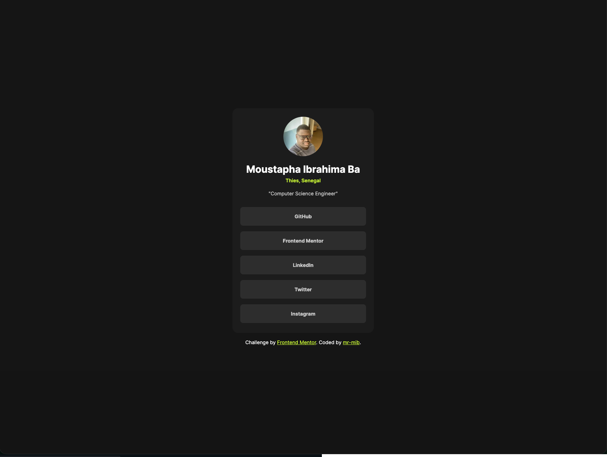

# Frontend Mentor - Social links profile solution

This is a solution to the [Social links profile challenge on Frontend Mentor](https://www.frontendmentor.io/challenges/social-links-profile-UG32l9m6dQ). Frontend Mentor challenges help you improve your coding skills by building realistic projects. 

## Table of contents

- [Frontend Mentor - Social links profile solution](#frontend-mentor---social-links-profile-solution)
  - [Table of contents](#table-of-contents)
  - [Overview](#overview)
    - [Screenshot](#screenshot)
    - [Links](#links)
  - [My process](#my-process)
    - [Built with](#built-with)
    - [Continued development](#continued-development)
    - [Useful resources](#useful-resources)
  - [Author](#author)
  - [Acknowledgments](#acknowledgments)

**Note: Delete this note and update the table of contents based on what sections you keep.**

## Overview

### Screenshot

### Links

- Solution URL: [https://github.com/mr-mib/Social-links-profile](https://github.com/mr-mib/Social-links-profile)
- Live Site URL: [https://mr-mib.github.io/Social-links-profile/](https://mr-mib.github.io/Social-links-profile/)

## My process

### Built with

- Semantic HTML5 markup
- CSS custom properties
- Flexbox

### Continued development

I might learn **Tailwind CSS** and rebuild this project.

### Useful resources

- [iloveimage](https://www.iloveimg.com/resize-image) - This helped me resize the image that I used as an avatar.

## Author

- Github - [mr-mib](https://github.com/mr-mib)
- Frontend Mentor - [@mr-mib](https://www.frontendmentor.io/profile/mr-mib)
- Twitter - [@Moustapha_I_Ba](https://x.com/Moustapha_I_Ba)

## Acknowledgments

This project was completed independently as part of my learning journey.

Special acknowledgment to the Frontend Mentor platform for providing structured, real-world frontend challenges.
